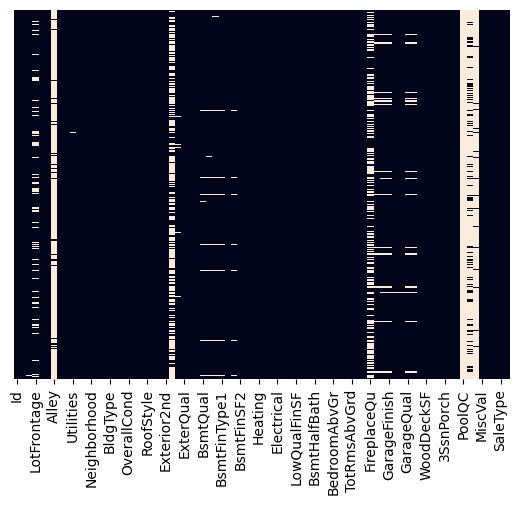
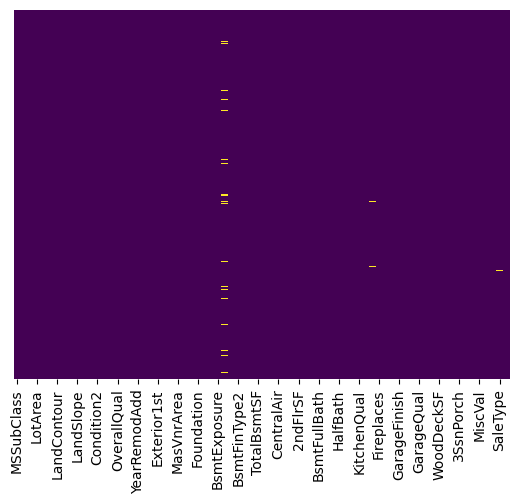

```python
import pandas as pd
import numpy as np
import matplotlib.pyplot as plt
import seaborn as sns
import plotly.express as px
```


```python
test_df=pd.read_csv('D:/UOM_3rd_Year/Semester 6/Data mining/Kaggle Competition/house-prices-advanced-regression-techniques/test.csv')
```


```python
test_df
```


<div>
<style scoped>
    .dataframe tbody tr th:only-of-type {
        vertical-align: middle;
    }

    .dataframe tbody tr th {
        vertical-align: top;
    }

    .dataframe thead th {
        text-align: right;
    }
</style>
<table border="1" class="dataframe">
  <thead>
    <tr style="text-align: right;">
      <th></th>
      <th>Id</th>
      <th>MSSubClass</th>
      <th>MSZoning</th>
      <th>LotFrontage</th>
      <th>LotArea</th>
      <th>Street</th>
      <th>Alley</th>
      <th>LotShape</th>
      <th>LandContour</th>
      <th>Utilities</th>
      <th>...</th>
      <th>ScreenPorch</th>
      <th>PoolArea</th>
      <th>PoolQC</th>
      <th>Fence</th>
      <th>MiscFeature</th>
      <th>MiscVal</th>
      <th>MoSold</th>
      <th>YrSold</th>
      <th>SaleType</th>
      <th>SaleCondition</th>
    </tr>
  </thead>
  <tbody>
    <tr>
      <th>0</th>
      <td>1461</td>
      <td>20</td>
      <td>RH</td>
      <td>80.0</td>
      <td>11622</td>
      <td>Pave</td>
      <td>NaN</td>
      <td>Reg</td>
      <td>Lvl</td>
      <td>AllPub</td>
      <td>...</td>
      <td>120</td>
      <td>0</td>
      <td>NaN</td>
      <td>MnPrv</td>
      <td>NaN</td>
      <td>0</td>
      <td>6</td>
      <td>2010</td>
      <td>WD</td>
      <td>Normal</td>
    </tr>
    <tr>
      <th>1</th>
      <td>1462</td>
      <td>20</td>
      <td>RL</td>
      <td>81.0</td>
      <td>14267</td>
      <td>Pave</td>
      <td>NaN</td>
      <td>IR1</td>
      <td>Lvl</td>
      <td>AllPub</td>
      <td>...</td>
      <td>0</td>
      <td>0</td>
      <td>NaN</td>
      <td>NaN</td>
      <td>Gar2</td>
      <td>12500</td>
      <td>6</td>
      <td>2010</td>
      <td>WD</td>
      <td>Normal</td>
    </tr>
    <tr>
      <th>2</th>
      <td>1463</td>
      <td>60</td>
      <td>RL</td>
      <td>74.0</td>
      <td>13830</td>
      <td>Pave</td>
      <td>NaN</td>
      <td>IR1</td>
      <td>Lvl</td>
      <td>AllPub</td>
      <td>...</td>
      <td>0</td>
      <td>0</td>
      <td>NaN</td>
      <td>MnPrv</td>
      <td>NaN</td>
      <td>0</td>
      <td>3</td>
      <td>2010</td>
      <td>WD</td>
      <td>Normal</td>
    </tr>
    <tr>
      <th>3</th>
      <td>1464</td>
      <td>60</td>
      <td>RL</td>
      <td>78.0</td>
      <td>9978</td>
      <td>Pave</td>
      <td>NaN</td>
      <td>IR1</td>
      <td>Lvl</td>
      <td>AllPub</td>
      <td>...</td>
      <td>0</td>
      <td>0</td>
      <td>NaN</td>
      <td>NaN</td>
      <td>NaN</td>
      <td>0</td>
      <td>6</td>
      <td>2010</td>
      <td>WD</td>
      <td>Normal</td>
    </tr>
    <tr>
      <th>4</th>
      <td>1465</td>
      <td>120</td>
      <td>RL</td>
      <td>43.0</td>
      <td>5005</td>
      <td>Pave</td>
      <td>NaN</td>
      <td>IR1</td>
      <td>HLS</td>
      <td>AllPub</td>
      <td>...</td>
      <td>144</td>
      <td>0</td>
      <td>NaN</td>
      <td>NaN</td>
      <td>NaN</td>
      <td>0</td>
      <td>1</td>
      <td>2010</td>
      <td>WD</td>
      <td>Normal</td>
    </tr>
    <tr>
      <th>...</th>
      <td>...</td>
      <td>...</td>
      <td>...</td>
      <td>...</td>
      <td>...</td>
      <td>...</td>
      <td>...</td>
      <td>...</td>
      <td>...</td>
      <td>...</td>
      <td>...</td>
      <td>...</td>
      <td>...</td>
      <td>...</td>
      <td>...</td>
      <td>...</td>
      <td>...</td>
      <td>...</td>
      <td>...</td>
      <td>...</td>
      <td>...</td>
    </tr>
    <tr>
      <th>1454</th>
      <td>2915</td>
      <td>160</td>
      <td>RM</td>
      <td>21.0</td>
      <td>1936</td>
      <td>Pave</td>
      <td>NaN</td>
      <td>Reg</td>
      <td>Lvl</td>
      <td>AllPub</td>
      <td>...</td>
      <td>0</td>
      <td>0</td>
      <td>NaN</td>
      <td>NaN</td>
      <td>NaN</td>
      <td>0</td>
      <td>6</td>
      <td>2006</td>
      <td>WD</td>
      <td>Normal</td>
    </tr>
    <tr>
      <th>1455</th>
      <td>2916</td>
      <td>160</td>
      <td>RM</td>
      <td>21.0</td>
      <td>1894</td>
      <td>Pave</td>
      <td>NaN</td>
      <td>Reg</td>
      <td>Lvl</td>
      <td>AllPub</td>
      <td>...</td>
      <td>0</td>
      <td>0</td>
      <td>NaN</td>
      <td>NaN</td>
      <td>NaN</td>
      <td>0</td>
      <td>4</td>
      <td>2006</td>
      <td>WD</td>
      <td>Abnorml</td>
    </tr>
    <tr>
      <th>1456</th>
      <td>2917</td>
      <td>20</td>
      <td>RL</td>
      <td>160.0</td>
      <td>20000</td>
      <td>Pave</td>
      <td>NaN</td>
      <td>Reg</td>
      <td>Lvl</td>
      <td>AllPub</td>
      <td>...</td>
      <td>0</td>
      <td>0</td>
      <td>NaN</td>
      <td>NaN</td>
      <td>NaN</td>
      <td>0</td>
      <td>9</td>
      <td>2006</td>
      <td>WD</td>
      <td>Abnorml</td>
    </tr>
    <tr>
      <th>1457</th>
      <td>2918</td>
      <td>85</td>
      <td>RL</td>
      <td>62.0</td>
      <td>10441</td>
      <td>Pave</td>
      <td>NaN</td>
      <td>Reg</td>
      <td>Lvl</td>
      <td>AllPub</td>
      <td>...</td>
      <td>0</td>
      <td>0</td>
      <td>NaN</td>
      <td>MnPrv</td>
      <td>Shed</td>
      <td>700</td>
      <td>7</td>
      <td>2006</td>
      <td>WD</td>
      <td>Normal</td>
    </tr>
    <tr>
      <th>1458</th>
      <td>2919</td>
      <td>60</td>
      <td>RL</td>
      <td>74.0</td>
      <td>9627</td>
      <td>Pave</td>
      <td>NaN</td>
      <td>Reg</td>
      <td>Lvl</td>
      <td>AllPub</td>
      <td>...</td>
      <td>0</td>
      <td>0</td>
      <td>NaN</td>
      <td>NaN</td>
      <td>NaN</td>
      <td>0</td>
      <td>11</td>
      <td>2006</td>
      <td>WD</td>
      <td>Normal</td>
    </tr>
  </tbody>
</table>
<p>1459 rows × 80 columns</p>
</div>


```python
test_df.head()
```


<div>
<style scoped>
    .dataframe tbody tr th:only-of-type {
        vertical-align: middle;
    }

    .dataframe tbody tr th {
        vertical-align: top;
    }

    .dataframe thead th {
        text-align: right;
    }
</style>
<table border="1" class="dataframe">
  <thead>
    <tr style="text-align: right;">
      <th></th>
      <th>Id</th>
      <th>MSSubClass</th>
      <th>MSZoning</th>
      <th>LotFrontage</th>
      <th>LotArea</th>
      <th>Street</th>
      <th>Alley</th>
      <th>LotShape</th>
      <th>LandContour</th>
      <th>Utilities</th>
      <th>...</th>
      <th>ScreenPorch</th>
      <th>PoolArea</th>
      <th>PoolQC</th>
      <th>Fence</th>
      <th>MiscFeature</th>
      <th>MiscVal</th>
      <th>MoSold</th>
      <th>YrSold</th>
      <th>SaleType</th>
      <th>SaleCondition</th>
    </tr>
  </thead>
  <tbody>
    <tr>
      <th>0</th>
      <td>1461</td>
      <td>20</td>
      <td>RH</td>
      <td>80.0</td>
      <td>11622</td>
      <td>Pave</td>
      <td>NaN</td>
      <td>Reg</td>
      <td>Lvl</td>
      <td>AllPub</td>
      <td>...</td>
      <td>120</td>
      <td>0</td>
      <td>NaN</td>
      <td>MnPrv</td>
      <td>NaN</td>
      <td>0</td>
      <td>6</td>
      <td>2010</td>
      <td>WD</td>
      <td>Normal</td>
    </tr>
    <tr>
      <th>1</th>
      <td>1462</td>
      <td>20</td>
      <td>RL</td>
      <td>81.0</td>
      <td>14267</td>
      <td>Pave</td>
      <td>NaN</td>
      <td>IR1</td>
      <td>Lvl</td>
      <td>AllPub</td>
      <td>...</td>
      <td>0</td>
      <td>0</td>
      <td>NaN</td>
      <td>NaN</td>
      <td>Gar2</td>
      <td>12500</td>
      <td>6</td>
      <td>2010</td>
      <td>WD</td>
      <td>Normal</td>
    </tr>
    <tr>
      <th>2</th>
      <td>1463</td>
      <td>60</td>
      <td>RL</td>
      <td>74.0</td>
      <td>13830</td>
      <td>Pave</td>
      <td>NaN</td>
      <td>IR1</td>
      <td>Lvl</td>
      <td>AllPub</td>
      <td>...</td>
      <td>0</td>
      <td>0</td>
      <td>NaN</td>
      <td>MnPrv</td>
      <td>NaN</td>
      <td>0</td>
      <td>3</td>
      <td>2010</td>
      <td>WD</td>
      <td>Normal</td>
    </tr>
    <tr>
      <th>3</th>
      <td>1464</td>
      <td>60</td>
      <td>RL</td>
      <td>78.0</td>
      <td>9978</td>
      <td>Pave</td>
      <td>NaN</td>
      <td>IR1</td>
      <td>Lvl</td>
      <td>AllPub</td>
      <td>...</td>
      <td>0</td>
      <td>0</td>
      <td>NaN</td>
      <td>NaN</td>
      <td>NaN</td>
      <td>0</td>
      <td>6</td>
      <td>2010</td>
      <td>WD</td>
      <td>Normal</td>
    </tr>
    <tr>
      <th>4</th>
      <td>1465</td>
      <td>120</td>
      <td>RL</td>
      <td>43.0</td>
      <td>5005</td>
      <td>Pave</td>
      <td>NaN</td>
      <td>IR1</td>
      <td>HLS</td>
      <td>AllPub</td>
      <td>...</td>
      <td>144</td>
      <td>0</td>
      <td>NaN</td>
      <td>NaN</td>
      <td>NaN</td>
      <td>0</td>
      <td>1</td>
      <td>2010</td>
      <td>WD</td>
      <td>Normal</td>
    </tr>
  </tbody>
</table>
<p>5 rows × 80 columns</p>
</div>


```python
sns.heatmap(test_df.isnull(),yticklabels=False,cbar=False)
```


    <Axes: >


    

    


```python
test_df.shape
```


    (1459, 80)


```python
test_df.info()
```

    <class 'pandas.core.frame.DataFrame'>
    RangeIndex: 1459 entries, 0 to 1458
    Data columns (total 80 columns):
     #   Column         Non-Null Count  Dtype  
    ---  ------         --------------  -----  
     0   Id             1459 non-null   int64  
     1   MSSubClass     1459 non-null   int64  
     2   MSZoning       1455 non-null   object 
     3   LotFrontage    1232 non-null   float64
     4   LotArea        1459 non-null   int64  
     5   Street         1459 non-null   object 
     6   Alley          107 non-null    object 
     7   LotShape       1459 non-null   object 
     8   LandContour    1459 non-null   object 
     9   Utilities      1457 non-null   object 
     10  LotConfig      1459 non-null   object 
     11  LandSlope      1459 non-null   object 
     12  Neighborhood   1459 non-null   object 
     13  Condition1     1459 non-null   object 
     14  Condition2     1459 non-null   object 
     15  BldgType       1459 non-null   object 
     16  HouseStyle     1459 non-null   object 
     17  OverallQual    1459 non-null   int64  
     18  OverallCond    1459 non-null   int64  
     19  YearBuilt      1459 non-null   int64  
     20  YearRemodAdd   1459 non-null   int64  
     21  RoofStyle      1459 non-null   object 
     22  RoofMatl       1459 non-null   object 
     23  Exterior1st    1458 non-null   object 
     24  Exterior2nd    1458 non-null   object 
     25  MasVnrType     565 non-null    object 
     26  MasVnrArea     1444 non-null   float64
     27  ExterQual      1459 non-null   object 
     28  ExterCond      1459 non-null   object 
     29  Foundation     1459 non-null   object 
     30  BsmtQual       1415 non-null   object 
     31  BsmtCond       1414 non-null   object 
     32  BsmtExposure   1415 non-null   object 
     33  BsmtFinType1   1417 non-null   object 
     34  BsmtFinSF1     1458 non-null   float64
     35  BsmtFinType2   1417 non-null   object 
     36  BsmtFinSF2     1458 non-null   float64
     37  BsmtUnfSF      1458 non-null   float64
     38  TotalBsmtSF    1458 non-null   float64
     39  Heating        1459 non-null   object 
     40  HeatingQC      1459 non-null   object 
     41  CentralAir     1459 non-null   object 
     42  Electrical     1459 non-null   object 
     43  1stFlrSF       1459 non-null   int64  
     44  2ndFlrSF       1459 non-null   int64  
     45  LowQualFinSF   1459 non-null   int64  
     46  GrLivArea      1459 non-null   int64  
     47  BsmtFullBath   1457 non-null   float64
     48  BsmtHalfBath   1457 non-null   float64
     49  FullBath       1459 non-null   int64  
     50  HalfBath       1459 non-null   int64  
     51  BedroomAbvGr   1459 non-null   int64  
     52  KitchenAbvGr   1459 non-null   int64  
     53  KitchenQual    1458 non-null   object 
     54  TotRmsAbvGrd   1459 non-null   int64  
     55  Functional     1457 non-null   object 
     56  Fireplaces     1459 non-null   int64  
     57  FireplaceQu    729 non-null    object 
     58  GarageType     1383 non-null   object 
     59  GarageYrBlt    1381 non-null   float64
     60  GarageFinish   1381 non-null   object 
     61  GarageCars     1458 non-null   float64
     62  GarageArea     1458 non-null   float64
     63  GarageQual     1381 non-null   object 
     64  GarageCond     1381 non-null   object 
     65  PavedDrive     1459 non-null   object 
     66  WoodDeckSF     1459 non-null   int64  
     67  OpenPorchSF    1459 non-null   int64  
     68  EnclosedPorch  1459 non-null   int64  
     69  3SsnPorch      1459 non-null   int64  
     70  ScreenPorch    1459 non-null   int64  
     71  PoolArea       1459 non-null   int64  
     72  PoolQC         3 non-null      object 
     73  Fence          290 non-null    object 
     74  MiscFeature    51 non-null     object 
     75  MiscVal        1459 non-null   int64  
     76  MoSold         1459 non-null   int64  
     77  YrSold         1459 non-null   int64  
     78  SaleType       1458 non-null   object 
     79  SaleCondition  1459 non-null   object 
    dtypes: float64(11), int64(26), object(43)
    memory usage: 912.0+ KB
    


```python
test_df.isnull().sum()
```


    Id                 0
    MSSubClass         0
    MSZoning           4
    LotFrontage      227
    LotArea            0
                    ... 
    MiscVal            0
    MoSold             0
    YrSold             0
    SaleType           1
    SaleCondition      0
    Length: 80, dtype: int64


```python
test_df.drop(['Alley'],axis=1,inplace=True)
```


```python
test_df.drop(['GarageYrBlt'],axis=1,inplace=True)
```


```python
test_df.drop(['PoolQC','Fence','MiscFeature'],axis=1,inplace=True)
```


```python
test_df.drop(['Id'],axis=1,inplace=True)
```


```python
test_df['LotFrontage']=test_df['LotFrontage'].fillna(test_df['LotFrontage'].mean())
```


```python
test_df['MSZoning']=test_df['MSZoning'].fillna(test_df['MSZoning'].mode()[0])
```


```python
test_df['BsmtCond']=test_df['BsmtCond'].fillna(test_df['BsmtCond'].mode()[0])
test_df['BsmtQual']=test_df['BsmtQual'].fillna(test_df['BsmtQual'].mode()[0])
```


```python
test_df['FireplaceQu']=test_df['FireplaceQu'].fillna(test_df['FireplaceQu'].mode()[0])
test_df['GarageType']=test_df['GarageType'].fillna(test_df['GarageType'].mode()[0])
```


```python
test_df['GarageFinish']=test_df['GarageFinish'].fillna(test_df['GarageFinish'].mode()[0])
test_df['GarageQual']=test_df['GarageQual'].fillna(test_df['GarageQual'].mode()[0])
test_df['GarageCond']=test_df['GarageCond'].fillna(test_df['GarageCond'].mode()[0])
```


```python
test_df['MasVnrType']=test_df['MasVnrType'].fillna(test_df['MasVnrType'].mode()[0])
test_df['MasVnrArea']=test_df['MasVnrArea'].fillna(test_df['MasVnrArea'].mode()[0])
```


```python
test_df['BsmtExposure']=test_df['BsmtExposure'].fillna(test_df['BsmtExposure'].mode()[0])
```


```python
test_df['BsmtFinType2']=test_df['BsmtFinType2'].fillna(test_df['BsmtFinType2'].mode()[0])
```


```python
sns.heatmap(test_df.isnull(),yticklabels=False,cbar=False,cmap='viridis')
```


    <Axes: >


    

    


```python
test_df.loc[:, test_df.isnull().any()].head()
```


<div>
<style scoped>
    .dataframe tbody tr th:only-of-type {
        vertical-align: middle;
    }

    .dataframe tbody tr th {
        vertical-align: top;
    }

    .dataframe thead th {
        text-align: right;
    }
</style>
<table border="1" class="dataframe">
  <thead>
    <tr style="text-align: right;">
      <th></th>
      <th>Utilities</th>
      <th>Exterior1st</th>
      <th>Exterior2nd</th>
      <th>BsmtFinType1</th>
      <th>BsmtFinSF1</th>
      <th>BsmtFinSF2</th>
      <th>BsmtUnfSF</th>
      <th>TotalBsmtSF</th>
      <th>BsmtFullBath</th>
      <th>BsmtHalfBath</th>
      <th>KitchenQual</th>
      <th>Functional</th>
      <th>GarageCars</th>
      <th>GarageArea</th>
      <th>SaleType</th>
    </tr>
  </thead>
  <tbody>
    <tr>
      <th>0</th>
      <td>AllPub</td>
      <td>VinylSd</td>
      <td>VinylSd</td>
      <td>Rec</td>
      <td>468.0</td>
      <td>144.0</td>
      <td>270.0</td>
      <td>882.0</td>
      <td>0.0</td>
      <td>0.0</td>
      <td>TA</td>
      <td>Typ</td>
      <td>1.0</td>
      <td>730.0</td>
      <td>WD</td>
    </tr>
    <tr>
      <th>1</th>
      <td>AllPub</td>
      <td>Wd Sdng</td>
      <td>Wd Sdng</td>
      <td>ALQ</td>
      <td>923.0</td>
      <td>0.0</td>
      <td>406.0</td>
      <td>1329.0</td>
      <td>0.0</td>
      <td>0.0</td>
      <td>Gd</td>
      <td>Typ</td>
      <td>1.0</td>
      <td>312.0</td>
      <td>WD</td>
    </tr>
    <tr>
      <th>2</th>
      <td>AllPub</td>
      <td>VinylSd</td>
      <td>VinylSd</td>
      <td>GLQ</td>
      <td>791.0</td>
      <td>0.0</td>
      <td>137.0</td>
      <td>928.0</td>
      <td>0.0</td>
      <td>0.0</td>
      <td>TA</td>
      <td>Typ</td>
      <td>2.0</td>
      <td>482.0</td>
      <td>WD</td>
    </tr>
    <tr>
      <th>3</th>
      <td>AllPub</td>
      <td>VinylSd</td>
      <td>VinylSd</td>
      <td>GLQ</td>
      <td>602.0</td>
      <td>0.0</td>
      <td>324.0</td>
      <td>926.0</td>
      <td>0.0</td>
      <td>0.0</td>
      <td>Gd</td>
      <td>Typ</td>
      <td>2.0</td>
      <td>470.0</td>
      <td>WD</td>
    </tr>
    <tr>
      <th>4</th>
      <td>AllPub</td>
      <td>HdBoard</td>
      <td>HdBoard</td>
      <td>ALQ</td>
      <td>263.0</td>
      <td>0.0</td>
      <td>1017.0</td>
      <td>1280.0</td>
      <td>0.0</td>
      <td>0.0</td>
      <td>Gd</td>
      <td>Typ</td>
      <td>2.0</td>
      <td>506.0</td>
      <td>WD</td>
    </tr>
  </tbody>
</table>
</div>


```python
test_df['Utilities']=test_df['Utilities'].fillna(test_df['Utilities'].mode()[0])
test_df['Exterior1st']=test_df['Exterior1st'].fillna(test_df['Exterior1st'].mode()[0])
test_df['Exterior2nd']=test_df['Exterior2nd'].fillna(test_df['Exterior2nd'].mode()[0])
test_df['BsmtFinType1']=test_df['BsmtFinType1'].fillna(test_df['BsmtFinType1'].mode()[0])
test_df['BsmtFinSF1']=test_df['BsmtFinSF1'].fillna(test_df['BsmtFinSF1'].mean())
test_df['BsmtFinSF2']=test_df['BsmtFinSF2'].fillna(test_df['BsmtFinSF2'].mean())
test_df['BsmtUnfSF']=test_df['BsmtUnfSF'].fillna(test_df['BsmtUnfSF'].mean())
test_df['TotalBsmtSF']=test_df['TotalBsmtSF'].fillna(test_df['TotalBsmtSF'].mean())
test_df['BsmtFullBath']=test_df['BsmtFullBath'].fillna(test_df['BsmtFullBath'].mode()[0])
test_df['BsmtHalfBath']=test_df['BsmtHalfBath'].fillna(test_df['BsmtHalfBath'].mode()[0])
test_df['KitchenQual']=test_df['KitchenQual'].fillna(test_df['KitchenQual'].mode()[0])
test_df['Functional']=test_df['Functional'].fillna(test_df['Functional'].mode()[0])
test_df['GarageCars']=test_df['GarageCars'].fillna(test_df['GarageCars'].mean())
test_df['GarageArea']=test_df['GarageArea'].fillna(test_df['GarageArea'].mean())
test_df['SaleType']=test_df['SaleType'].fillna(test_df['SaleType'].mode()[0])
```


```python
test_df.shape
```


    (1459, 74)


```python
test_df.to_csv('formulatedtest.csv',index=False)
```


```python

```
